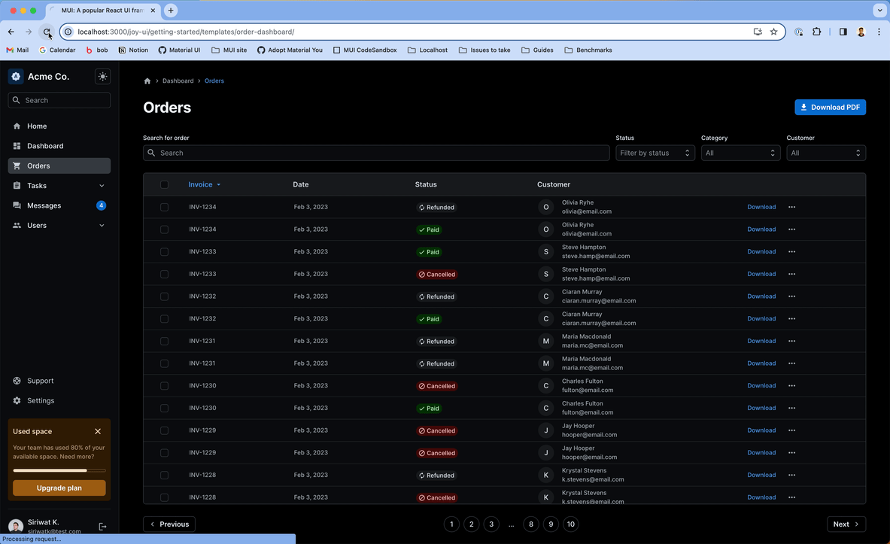

When I was looking at the light/dark theme toggle in this blog, it occured to me that the way I'd always done it was not the right way. And likely, the majority of guides on "how to implement dark theme" are also doing it incorrectly.

It might seem really trivial, but I was surprised at how easy it is to get it wrong, and I'm particularly surprised that the go-to for many is to use a library like `next-themes`.

## The Core Issue

The fundamental problem lies in the gap between server-rendered HTML and client-side JavaScript execution.

In client-side rendering (CSR), your browser downloads an empty HTML shell, fetches your React bundle, and then renders everything—simple, but slow for initial page loads and terrible for SEO.

Server-side rendering flips this. The server pre-renders your React components into HTML and sends that to the browser immediately. The user sees content instantly, then JavaScript "hydrates" to make it interactive.

This creates a critical window where the server's assumptions about your app state (like theme preference) might not match the client's reality. This can cause a jarring flash when React realizes it got things wrong and re-renders with the correct theme.

## The Problem

Here is a pretty common implementation of how a dark/light theme toggle may be selected.

We use a `ThemeContext` to store the theme. Initialize the theme in a `useEffect`, checking both `localStorage` and the system preference.

```ts
const ThemeContext = createContext();

export function ThemeProvider({ children }) {
  const [theme, setTheme] = useState('light');

  // Initialize theme
  useEffect(() => {
    const savedTheme = localStorage.getItem('theme');
    const systemPrefersDark = window.matchMedia('(prefers-color-scheme: dark)').matches;
    // theme = localStorage (system preference as fallback)
    setTheme(savedTheme || (systemPrefersDark ? 'dark' : 'light'));
  }, []);

  return (
    <ThemeContext.Provider value={{ theme, setTheme }}>
      {children}
    </ThemeContext.Provider>
  );
}

export function useTheme() {
  return useContext(ThemeContext);
}
```

### The FOUC Problem

When you render UI on the server, the server has no access to `localStorage`, `window.matchMedia`, or any client-specific state. It must make essentially guess - typically defaulting to light theme.

The problem unfolds during hydration:

1. Server renders HTML with light theme (its best guess)
2. Browser displays this HTML immediately  
3. JavaScript loads and React checks `localStorage`, and discovers user prefers dark
4. React re-renders with dark theme, causing a visible flash

This visual inconsistency is called a **Flash of Unstyled Content (FOUC)**, when a page briefly displays the wrong theme before correcting itself. This creates a jarring user experience and may trigger hydration errors in some frameworks.

The Material UI documentation has a very good gif to show this issue.




## Some Solutions

There are two fundamental solutions to this issue. You can:
1. Put a blocking script at the start of your `index.html` file, or
2. Store your theme preference in a cookie.

The first is significantly simpler than the second, but it also brings some limitations.

### 1. Insert a blocking script

Instead of checking the user's theme preference in the `useEffect`, you can check it in a blocking script *before* any content renders.

Your `index.html` may look like this:

```html
<!doctype html>
<html lang="en">
  <head>
    <meta charset="UTF-8" />
    <meta name="color-scheme" content="light dark" />
    <link rel="icon" type="image/svg+xml" href="/corgi_circle_144x144.png" />
    <meta name="viewport" content="width=device-width, initial-scale=1.0" />
    <!-- Must by SYNCHRONOUS. No defer or async.-->
    <script>
      (function(){
        const theme = localStorage.getItem('theme')
          || (window.matchMedia("(prefers-color-scheme: dark)").matches ? 'dark' : 'light')
        document.documentElement.setAttribute('data-theme', theme)
      })()
    </script>
    <!-- The rest of your head -->
  </head>
  <body>
    <!-- Your body here -->
  </body>
</html>
```

We store the theme somewhere that can be queried by CSS. In this case, we store it in the `data-theme` attribute on the `html` element.

Your context provider can just read this attribute:

```ts
export function ThemeProvider({ children }) {
  const [theme, _setTheme] = useState('light');

  useEffect(() => {
    _setTheme(document.documentElement.getAttribute('data-theme'));
  }, []);

  const setTheme = (newTheme) => {
    _setTheme(newTheme);
    document.documentElement.setAttribute('data-theme', newTheme);
    localStorage.setItem('theme', newTheme);
  }

  return (
    <ThemeContext.Provider value={{ theme, setTheme }}>
      {children}
    </ThemeContext.Provider>
  );
}
```

Your CSS may now look like this:

```css
:root {
  --color-bg: #fff;
  --color-text: #000;
}

:root[data-theme='dark'] {
  --color-bg: #000;
  --color-text: #fff;
}
```

With these changes, the rendering process now looks like this:

1. The browser makes a request.
2. The server renders your React application with a default theme (typically light).
3. The browser downloads the HTML file, and runs the blocking script to set the theme.
4. The browser renders the UI with the correct theme, based on your CSS.
5. The browser downloads the React application.
6. The browser executes the React application and reconciles the theme state. **But because the theme is already set in the CSS, React doesn't need to do anything.**
7. The React application hydrates the UI, and makes it interactive.

The key insight here is that while React still reconciles the theme state during hydration (step 6), the user never sees a visual flicker because the CSS has already applied the correct theme styling from step 4. React updates its internal state to match what's already displayed.

There you go, no FOUC.

#### The Catch

The *catch* to this approach is that your theming **must go through CSS**. If you have JavaScript logic that conditionally renders different components based on theme, you're back to square one:

```js
const SomeComponent = () => {
  const { theme } = useTheme()

  return (
    {theme === 'dark' ? <DarkComponent /> : <LightComponent />}
  )
}
```

This breaks because React needs to hydrate before it knows the theme, causing the same flash.

**Restructuring strategies:**

1. **Move logic to CSS**: Instead of conditional rendering, use CSS to show/hide elements:
   ```css
   .light-only { display: block; }
   .dark-only { display: none; }
   
   [data-theme='dark'] .light-only { display: none; }
   [data-theme='dark'] .dark-only { display: block; }
   ```

2. **Use CSS custom properties for dynamic values**: Replace JavaScript calculations with CSS:
   ```css
   :root { --sidebar-width: 240px; }
   [data-theme='dark'] { --sidebar-width: 280px; }
   ```

3. **Defer non-critical theme-dependent logic**: Keep essential UI theme-agnostic, lazy-load complex theme-dependent features after hydration.

When the blocking script approach becomes insufficient—typically in apps with heavy theme-dependent rendering logic—the cookie approach becomes necessary despite its caching complexity.

### 2. Use a Cookie

Logically, if you have an issue because the server does not know the client state, you can solve the problem by *sending* the client state to the server.

This is a bit more involved, but the most convenient way to do this is with a cookie.

Here is what your ThemeProvider may look like:

```jsx
export function ThemeProvider({ children }) {
  const [theme, _setTheme] = useState('light');

  const setTheme = (newTheme) => {
    _setTheme(newTheme);
    // Set cookie
    const encodedTheme = encodeURIComponent(newTheme);
    document.cookie = `theme=${encodedTheme}; path=/; max-age=31536000; SameSite=Lax; Secure`;
    // Update data-theme attribute for CSS theming
    document.documentElement.setAttribute('data-theme', newTheme);
  };

  // only run on client side
  useEffect(() => {
    const cookieValue = document.cookie
      .split('; ')
      .find(row => row.startsWith('theme='))
      ?.split('=')[1];
    
    if (cookieValue) {
      setTheme(decodeURIComponent(cookieValue));
    } else {
      // Fallback to system preference if no cookie
      const systemPrefersDark = window.matchMedia('(prefers-color-scheme: dark)').matches;
      const preferredTheme = systemPrefersDark ? 'dark' : 'light';
      setTheme(preferredTheme);
    }
  }, []);

  return (
    <ThemeContext.Provider value={{ theme, setTheme }}>
      {children}
    </ThemeContext.Provider>
  );
}
```

Next, you need to configure your SSR server to receive the cookie correctly, and select the proper theme while rendering. Your mileage may vary, depending on your server setup and framework, something like `cookies()` from `next/headers` in a Next.js setup.

Your cookie also needs to have `SameSite=Lax` enabled, so that it will be sent with cross-site requests.

This approach comes with some caching implications. Particularly, pages now vary per user preference—dark theme users need different HTML than light theme users. This breaks your ability to do simple static caching.

Your CDN must now cache multiple variants of each page, or you lose the caching benefits entirely. Some solutions are:

1. Configure your CDN to cache variants by cookie value:
   ```
   Vary: Cookie
   Cache-Key: url + theme-cookie-value
   ```
2. Use an additional proxy to modify HTML dynamically:
   ```js
   // Pseudo-code: inject theme script based on cookie
   if (request.cookies.theme === 'dark') {
     return modifyHTML(response, 'dark')
   }
   ```

This caching complexity is why many developers prefer the blocking script approach despite its CSS limitations.

So, here are the two solutions. You can either insert a blocking script, or transmit the theme preference as a cookie. Or I suppose it does not matter if you're on CSR.

## How do libraries do it?

Libraries typically fall into two categories: those that **avoid FOUC out of the box** by injecting blocking scripts, and those that **provide hooks only** and leave FOUC prevention to you.

### Libraries that avoid FOUC out of the box

#### `next-themes`

`next-themes` injects a script on the server-side with a `dangerouslySetInnerHTML` attribute, on the [`<ThemeScript>`](https://github.com/pacocoursey/next-themes/blob/main/next-themes/src/index.tsx#L187) element. The script looks like this:

```typescript
export const script = (
  attribute,
  storageKey,
  defaultTheme,
  forcedTheme,
  themes,
  value,
  enableSystem,
  enableColorScheme
) => {
  const el = document.documentElement
  const systemThemes = ['light', 'dark']

  function updateDOM(theme: string) {
    const attributes = Array.isArray(attribute) ? attribute : [attribute]

    attributes.forEach(attr => {
      const isClass = attr === 'class'
      const classes = isClass && value ? themes.map(t => value[t] || t) : themes
      if (isClass) {
        el.classList.remove(...classes)
        el.classList.add(value && value[theme] ? value[theme] : theme)
      } else {
        el.setAttribute(attr, theme)
      }
    })

    setColorScheme(theme)
  }

  function setColorScheme(theme: string) {
    if (enableColorScheme && systemThemes.includes(theme)) {
      el.style.colorScheme = theme
    }
  }

  function getSystemTheme() {
    return window.matchMedia('(prefers-color-scheme: dark)').matches ? 'dark' : 'light'
  }

  if (forcedTheme) {
    updateDOM(forcedTheme)
  } else {
    try {
      const themeName = localStorage.getItem(storageKey) || defaultTheme
      const isSystem = enableSystem && themeName === 'system'
      const theme = isSystem ? getSystemTheme() : themeName
      updateDOM(theme)
    } catch (e) {
      //
    }
  }
}
```

#### Material UI

Material UI also uses a similar [approach](https://github.com/mui/material-ui/blob/master/packages/mui-system/src/InitColorSchemeScript/InitColorSchemeScript.tsx) to inject the script:

```jsx
export default function InitColorSchemeScript(options?: InitColorSchemeScriptProps) {
  // lots of logic here
  return (
    <script
      key="mui-color-scheme-init"
      suppressHydrationWarning
      nonce={typeof window === 'undefined' ? nonce : ''}
      // eslint-disable-next-line react/no-danger
      dangerouslySetInnerHTML={{
        __html: `(function() {
try {
  let colorScheme = '';
  const mode = localStorage.getItem('${modeStorageKey}') || '${defaultMode}';
  const dark = localStorage.getItem('${colorSchemeStorageKey}-dark') || '${defaultDarkColorScheme}';
  const light = localStorage.getItem('${colorSchemeStorageKey}-light') || '${defaultLightColorScheme}';
  if (mode === 'system') {
    // handle system mode
    const mql = window.matchMedia('(prefers-color-scheme: dark)');
    if (mql.matches) {
      colorScheme = dark
    } else {
      colorScheme = light
    }
  }
  if (mode === 'light') {
    colorScheme = light;
  }
  if (mode === 'dark') {
    colorScheme = dark;
  }
  if (colorScheme) {
    ${setter}
  }
} catch(e){}})();`,
      }}
    />
  );
}
```

### Libraries with utilities

Other libraries give you theming utilities but require you to implement FOUC prevention yourself.

#### Tailwind CSS

Tailwind CSS pairs well with the blocking script approach. By default, its `:dark` selector uses the `prefers-color-scheme` media query, but you can override it with your own custom selector.

You can define dark styles in tailwind.config.js, and also write css queries such as `@custom-variant dark (&:where([data-theme=dark], [data-theme=dark] *));` to generates something like:

```css
.dark\:SOME-UNIQUE-IDENTIFIER:where([data-theme="dark"], [data-theme="dark"] *) {
  some: style;
}
```

Your blocking script can sets `class="dark"` on the root element, and Tailwind handles the rest.

#### Radix UI

Radix UI provides unstyled components that accept theme classes. Combine with CSS custom properties:

```css
:root { --radix-colors-bg: white; }
.dark { --radix-colors-bg: black; }
```

#### Mantine

Mantine uses the more modern [`light-dark()`](https://developer.mozilla.org/en-US/docs/Web/CSS/color_value/light-dark) CSS function, which respects the `color-scheme` property:

```css
.mantine-button { 
  background: light-dark(white, black); 
}
```

Set `color-scheme: dark` in your blocking script, and Mantine automatically adapts. This approach has excellent browser support and eliminates the need for class-based theming entirely. 

## Conclusion

The FOUC problem extends far beyond theming—any client-specific state (locale, feature flags, A/B tests, device preferences) faces the same fundamental challenge.

Fudamentally, there are three solutions to the FOUC SSR problem:
1. **Client-side deferral**: Render affected components only after hydration
2. **Blocking scripts**: Apply state before initial render using inline JavaScript
3. **Server state transmission**: Send client state to server (typically via cookies)

Understanding this tradeoff, rendering accuracy versus caching complexity is fundamental to building robust SSR applications.