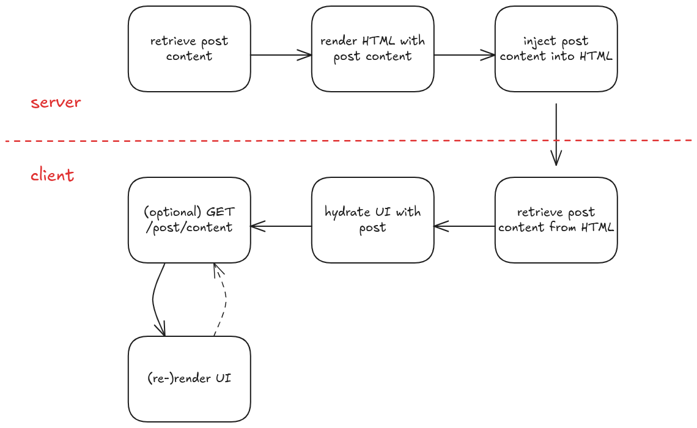
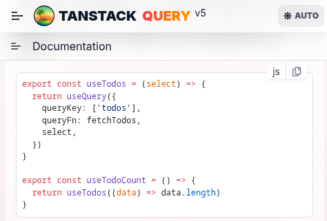

## Server-Side Rendering

SSR is a must for blogs, particularly because it enables search engine indexing.
And because blogs typically host static content, it also makes it an ideal target for some kind of static rendering and caching.

Vite provides its own server-side rendering feature, which allows
you to render your application on the server and send the rendered HTML to the client.
While it's a lot less full-featured than frameworks like Next.js, I chose Vite because I prefer to write my own abstractions.

Here are some highlights of what I ended up doing.

## SSR Architecture

Previously, our AWS architecture was pretty simple. It consisted of an S3 bucket, a CloudFront distribution, and a Route 53 record, and the browser directly retrieves the cached files from CloudFront.

For our SSR server, we can simply replace the storage bucket, and let our CloudFront distribution directly proxy requests to the SSR server.

<div className="flex justify-center">
  
</div>

Having CloudFront cache all the assets from our SSR server also significantly improves the blog's performance.
I can simply set a long cache TTL, and let CloudFront handle the caching for me.

With a long TTL on HTML, I must invalidate CloudFront on deploy.

In `Next.js` this quite similar to Incremental Static Regeneration (ISR), where you set a certain cache TTL, and the page is only regenerated when the cached page expires.
Mine doesn't revalidate automatically, though.

```hcl
# infra/modules/service/cloudfront.tf
resource "aws_cloudfront_cache_policy" "year_long_cache" {
  name        = var.cloudfront_cache_policy_name
  min_ttl     = 31536000 # 1 year (in seconds)
  max_ttl     = 31536000
  default_ttl = 31536000

  # ...
}
```

**Warning**: A 1-year TTL for HTML is risky without versioning. Consider either (a) versioned build IDs in response headers as part of the cache key, or (b) shorter TTL with stale-while-revalidate. For this blog, the trade-off favors simplicity over cache optimization.

### Cache Invalidation and Cold Starts

As mentioned previously, I must invalidate the cache when new blog posts are added (or existing posts are updated).

This is simple enough with a deployment script:

```bash
# deploy.sh
cloudfront_dist_id=$(tofu output -raw cloudfront_distribution_id)
aws cloudfront create-invalidation \
    --distribution-id ${cloudfront_dist_id} \
    --paths "/*"
```

Note that I invalidate *all* paths here, but CloudFront does support more granular invalidation.
For this blog's scale, blanket invalidation is simpler than implementing granular path logic.

But what it *does* mean is that after a blog post is added, the first request results in a **cache miss**, and my Lambda function renders the page.
This does lead to pretty disastrous performance for cold starts:

In our cold start scenario, the TTFB (Time to First Byte) is an abysmal **5.4 seconds**, and the page is rendered in **6.7 seconds**.

<div className="flex justify-center w-full">
  <div style={{ width: "min(450px, 100%)" }}>
    ")
  </div>
</div>

A few seconds of Lambda cold-start, combined with a measly 512MB of memory, and you get a poor user experience.

On the bright side, our LCP goes down to about **0.13 seconds** when loaded straight from CloudFront, which I am quite happy about.

<div className="flex justify-center w-full">
  <div style={{ width: "min(450px, 100%)" }}>
    
  </div>
</div>

### If it works, it works.

How did I fix the cold start issue?

It's quite simple, really. After running the deployment script, I warm the cache by just visiting the blog myself.

On the home page, when a post is visible to the user, I prefetch it with `<link rel="prefetch" href="...">`.

So I just need to wait for the landing page to load, and scroll to the bottom of the page, which will warm up the CloudFront cache.
This effectively converts the pull CDN into a push CDN (well, with a "manual" push).

This has some disadvantages (unnecessary Lambda invocations, increased CDN costs, etc.), but the cold-start performance is so abysmal that it's not even a question worth considering.

Alternatively, I can use something like AWS Lambda provisioned concurrency, or use an actual server instead of Lambda to get rid of cold starts altogether.

## SSR State Strikes Again

In my [previous post](/posts/2025-09-08-dark-theme-ssr) about Server-Side Rendering,
I talked about how SSR state can cause hydration errors, because
you had to load state in your server-side render, and then do another round of hydration client-side.

For this blog particularly, I wanted to manage state in the following way:



The extra (and unnecessary) `GET` request for the post content is actually a nice-to-have,
because it allows me to load the website in CSR mode as well, and this is particularly useful during development.

It also is not a very uncommon pattern for SSR applications.
You may fetch some data on the server to render the initial page,
and then re-fetch it on the client later on, if it gets stale.

### SsrStateContext

We can manage the state in a React context. It is pretty straightforward:

```tsx
const SsrStateContext = React.createContext<SsrStateData | null>(null);

type SsrStateProviderProps = {
  children: React.ReactNode;
  value: SsrStateData;
};

export const SsrStateProvider = ({
  children,
  value,
}: SsrStateProviderProps) => {
  return (
    <SsrStateContext.Provider value={value}>
      {children}
    </SsrStateContext.Provider>
  );
};

export const useSsrState = () => useContext(SsrStateContext);
```

On the server, we will wrap the root component in the `SsrStateProvider`, and pass the initial state to it.

```tsx
// server-entry.tsx
export function renderApp(location: string, initialSsrData: SsrStateData) {
  return renderToString(
    <SsrStateProvider value={initialSsrData}>
      <App location={location} />
    </SsrStateProvider>
  );
}
```

On the client, we will hydrate the state from the injected HTML.
We have previously injected the state into a `<script>` element in `<head>`,
so we can retrieve it from the DOM and delete the element.

**Security note**: When injecting JSON state, escape `<` to avoid XSS.
For me, this is the easiest way to do it.

```tsx
// server/html.ts
// inject the SSR state into the HTML
export const injectSsrState = (html: string, state: SsrStateData): string => {
    const safeJson = JSON.stringify(state).replace(/</g, "\\u003c");
    const div = `<script type="application/json" id=${SSR_STATE_ELEMENT_ID}>${safeJson}</script>`
    return html.replace('</head>', `${div}</head>`)
}

// client-entry.tsx
let ssrState: SsrStateData | null = null;

export const retrieveSsrState = (): SsrStateData => {
  if (ssrState) return ssrState;
  const el = document.getElementById(SSR_STATE_ELEMENT_ID);
  if (!el) throw new Error("SSR state element not found in the DOM");
  ssrState = JSON.parse(el.textContent || "{}");
  el?.remove();
  return ssrState!;
};

hydrateRoot(
  document.getElementById("root")!,
  <SsrStateProvider value={retrieveSsrState()}>
    <App location={window.location.pathname} />
  </SsrStateProvider>
);
```

## Implementation Iterations

### Putting it Together (1)

My first attempt at implementing this looked something like this:

```tsx
function PostPage() {
  const { slug } = useParams<{ slug: string }>();
  const [PostComponent, setPostComponent] = useState<MDXContent | null>(null);
  const [frontmatter, setFrontmatter] = useState<FrontMatter | null>(null);
  const { postContent } = useSsrState();
  // useEffect is not called on the server
  // so we need to check if the postContent is already available.
  if (postContent) {
    compileMdx(postContent) // compile .mdx file to jsx code
      .then(runMdx) // run the jsx code to get the frontmatter and component
      .then(({ frontmatter, component }) => {
        setFrontmatter(frontmatter);
        setPostComponent(component);
      });
  }

  useEffect(() => {
    (async () => {
      const postContent = await fetchPostContent(slug);
      const compiledPost = await compileMdx(postContent);
      const { frontmatter, component } = runMdx(compiledPost);
      setFrontmatter(frontmatter);
      setPostComponent(() => component);
    })();
  }, [slug]);

  return <PostComponent />;
}
```

This **does not work** for two reasons.

1. **`async` functions**

`renderToString()` is a **synchronous** function call. `async` functions are handled through microtasks,
and so `renderToString()` will not be able to wait for the `compileMdx` call to complete.
(Note: we now have `renderToPipeableStream` for asynchronous rendering, but I did not find the additional complexity worth it for this blog. Who knows, maybe I'll revisit it someday.)

The rendered HTML will therefore be empty.

2. **Code Duplication**

Because `useEffect` is not called on the server, we are forced to duplicate the `compileMdx` and `runMdx` calls in both the server and client code.

### Putting it Together (2)

Okay, because we have some code duplication, we have some motivation to create an abstraction.

We can create a custom hook to (1) retrieve the SSR state with `useSsrState`, and (2) fetch the post content with `useSsrFetch`, then emit the result to the `SsrStateProvider`.

We can call it `useSsrFetch`:

```tsx
type SsrFetchOptions<K extends keyof SsrStateData> = {
  key: K;
  fetchFn: () => Promise<SsrStateData[K]>;
};

export const useSsrFetch = <K extends keyof SsrStateData>({
  key,
  fetchFn,
}: SsrFetchOptions<K>): SsrFetchResult<SsrStateData[K]> => {
  const ssrState = useSsrState() as SsrStateData;
  const [data, setData] = useState<SsrStateData[K] | null>(ssrState[key]);

  const fetchCallback = useCallback(() => {
    fetchFn().then((data) => {
      setData(data);
    });
  }, [fetchFn]);

  useEffect(() => {
    if (data) return;
    fetchCallback();
  }, [fetchCallback, data]);

  return data;
};
```

Now, we can consume the data with a `useSsrFetch()` hook call.

It was also at this point I realized the async `compileMdx` call cannot be synchronous, so I had to move it to the server.

```tsx
function PostPage() {
  const { slug } = useParams<{ slug: string }>();
  const postContent = useSsrFetch({
    key: SSR_POST_CONTENT_KEY,
    fetchFn: () => fetchPostContent(slug),
  });

  // compileMdx moved to the server
  const { frontmatter, component: PostComponent } = runMdx(postContent);

  return <PostComponent />;
}
```

### Putting it Together (3)

I also noticed that I *always* wrap the return value from `useSsrFetch()` with `runMdx()`. I can abstract this into the hook.

I can also add `error` and `loading` states to the hook, and we get:

```tsx
import { useCallback, useEffect, useState } from "react";
import type { SsrStateData } from "../utils/types";
import { useSsrState } from "../context/ssr-state";

type SsrFetchOptions<K extends keyof SsrStateData, T> = {
  key: K;
  fetchFn: () => Promise<SsrStateData[K]>;
  select: (data: SsrStateData[K]) => T;
};

type SsrFetchResult<T> = {
  data: T | null;
  loading: boolean;
  error: string | null;
};

export const useSsrFetch = <K extends keyof SsrStateData, T>({
  key,
  fetchFn,
  select,
}: SsrFetchOptions<K, T>): SsrFetchResult<T> => {
  const ssrState = useSsrState() as SsrStateData;
  const [data, setData] = useState<SsrStateData[K] | null>(ssrState[key]);
  const [loading, setLoading] = useState(!ssrState[key]);
  const [error, setError] = useState<string | null>(null);

  const fetchCallback = useCallback(() => {
    setLoading(true);
    setError(null);
    fetchFn()
      .then((data) => {
        setData(data);
        setLoading(false);
      })
      .catch((err) => {
        setError(err?.message || "Error fetching data");
        setLoading(false);
      });
  }, [fetchFn]);

  useEffect(() => {
    if (data) {
      setLoading(false);
      return;
    }
    fetchCallback();
    // eslint-disable-next-line react-hooks/exhaustive-deps
  }, [fetchCallback]);

  return {
    // Unlike TanStack Query, we have no memoization here.
    data: data ? select(data) : null,
    loading,
    error,
  };
};
```

I can call it with:

```tsx
function PostPage() {
  const { data, loading, error } = useSsrFetch({
    key: SSR_POST_CONTENT_KEY,
    fetchFn: () => fetchPostContent(slug),
    select: runMdx, // returns { frontmatter, component }
  });

  if (loading || !data) return null; // or a skeleton
  const { component: PostComponent } = data;
  return <PostComponent />;
}
```

With this, I had no more SSR state-related issues.
`useSsrFetch`, beyond being a common pattern, is a good abstraction.
It eliminates code duplication between server and client, provides a predictable data flow,
and handles loading/error states consistently.

Btw, looks familiar?


[Source: TanStack Query](https://tanstack.com/query/latest/docs/framework/react/guides/render-optimizations#select)

The best way to understand an abstraction is to build it yourself.

## SEO & Metadata

Now that we have SSR, it is also important to add some SEO-friendly metadata to the page.

Here is a list of the ones I added:

**Basic metadata**:

- `<title>...</title>`
- `<meta name="description" content="...">`
- `<meta name="author" content="...">`
- `<meta name="keywords" content="...">`
- `<meta name="robots" content="index, follow">`
- `<link rel="canonical" href="...">`

**Open Graph metadata**:

- `<meta property="article:author" content="...">`
- `<meta property="og:type" content="...">`
- `<meta property="og:title" content="...">`
- `<meta property="og:description" content="...">`
- `<meta property="og:url" content="...">`
- `<meta property="og:image" content="...">`
- `<meta property="og:site_name" content="...">`

**Twitter metadata**:

- `<meta name="twitter:title" content="...">`
- `<meta name="twitter:description" content="...">`
- `<meta name="twitter:image" content="...">`

**JSON-LD metadata**:

- `<script type="application/ld+json">...</script>`

All of these tags are injected into the `<head>` element on the server.
I'm not using helmet or any library, it's just some simple string replacements.
The simple solution is a great one.

```ts
// Note: you need to remove the existing <title> tag in the base template
const injectTitle = (html: string, title: string) => {
  return html.replace("</head>", `<title>${title}</title>\n</head>`);
};

const injectCanonicalUrl = (html: string, canonicalUrl: string) => {
  return html.replace(
    "</head>",
    `<link rel="canonical" href="${canonicalUrl}">\n</head>`
  );
};

export const injectMetaTags = (html: string, metaTags: MetaTag[]) => {
  const metaTagsHtml = metaTags
    .map((tag) => {
      if ("name" in tag) {
        return `<meta name="${tag.name}" content="${tag.content}">`;
      } else {
        return `<meta property="${tag.property}" content="${tag.content}">`;
      }
    })
    .join("\n");

  return html.replace("</head>", `${metaTagsHtml}\n</head>`);
};

const injectGoogleJsonLd = (html: string, googleJsonLd: any) => {
  return html.replace(
    "</head>",
    `<script type="application/ld+json">${JSON.stringify(
      googleJsonLd
    )}</script>\n</head>`
  );
};
```

There is a few metadata that are not included here (such as `og:updated_time` and `twitter:card`),
but I find that this is a sufficient set for now.

## Conclusion

This was a fun and interesting feature on the blog.

The SSR implementation delivers better SEO through server-rendered content,
great performance via CloudFront caching,
and much better maintainability with hooks like `useSsrFetch` that eliminate code duplication between server and client.

Of course, there are still a few things pending for future improvements:

1. **Asset management**: Move blog assets from container image to S3 for better scalability
2. **RSS feed**: Add RSS feed for better content syndication
3. **Sitemap**: Implement XML sitemap for search engine indexing
4. **Analytics**: Add analytics and performance tracking

But for now, I'm happy with the result.
