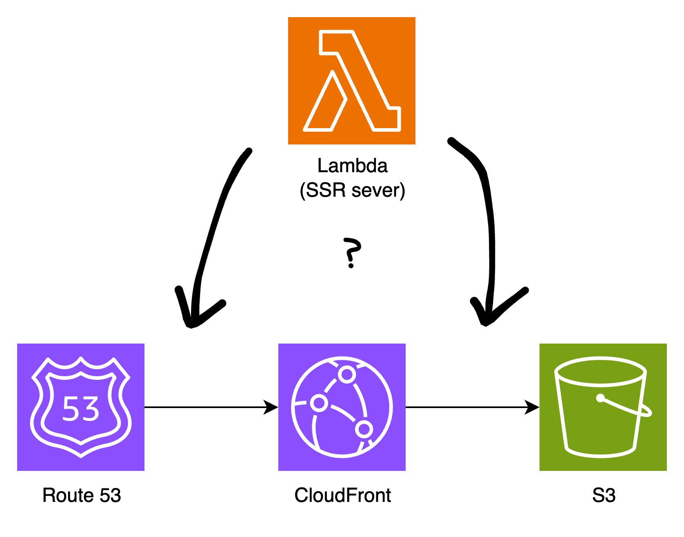

I think it is quite time that I have proper SSR and Observability in this blog.

## Observability

For observability, I've decided to use PostHog, as recommended by my friend Zhekai.

## SSR

SSR is a must for blogs, particularly because it allows your site to be indexed by search engines. And because blogs typically host static content, it also makes it an ideal target for some kind of static rendering and caching.

Vite provides it's own server-side rendering (SSR) feature, which allows you to render your application on the server and send the rendered HTML to the client.

### Staging Environment

Speaking of which, it is about time I have a staging environment ([staging.blog.yongbeom.com](https://staging.blog.yongbeom.com)) to test the new SSR architecture, so we will quickly do it (yay, opentofu!):

`main.tf`
```diff 
module "prod" {
    source = "./terraform"
    website_s3_bucket = "blog.yongbeom.com-bucket"
    cloudfront_cache_policy_name = "yongbeom-com-personal-blog-cache-policy"
    base_domain = "yongbeom.com"
    full_domain = "blog.yongbeom.com"
}

+ module "staging" {
+     source = "./terraform"
+     website_s3_bucket = "blog.yongbeom.com-bucket-staging"
+     cloudfront_cache_policy_name = "yongbeom-com-personal-blog-cache-policy-staging"
+     base_domain = "yongbeom.com"
+     full_domain = "staging.blog.yongbeom.com"
+ }
```

### SSR Architecture

Previously, our AWS architecture was pretty simple. It consisted of an S3 bucket, a CloudFront distribution, and a Route 53 record, and the browser directly retrieves the cached files from CloudFront.

I can either put the SSR server before (Lambda@Edge / CloudFront Functions), or after the CloudFront distribution as a normal Lambda function.



Given that a blog fundamentally has the majority of its content is *static*, it benefits significantly from CDN caching. Therefore, we will put the SSR server after the CloudFront distribution. If our blog had some dynamic content, we may have chosen to put the SSR server *before* the CloudFront distribution.

In addition, this allows the browser to get cached HTML directly from CloudFront, which significantly improves the blog's performance.

### SSR Server

The SSR server is a simple Node.js server that renders the blog posts and returns the HTML to the client. It is deployed as a Lambda function.

