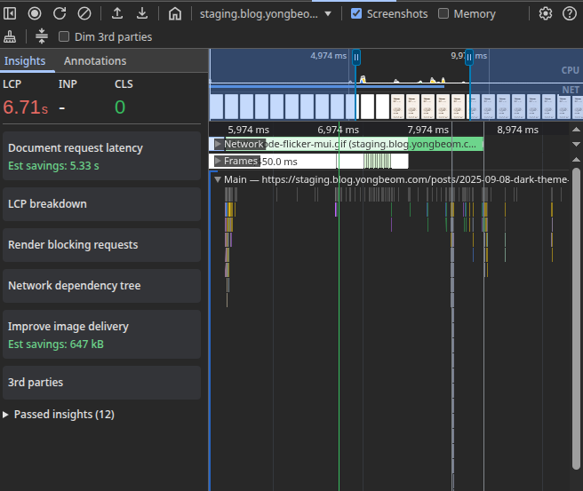

## Server-Side Rendering

SSR is a must for blogs, particularly because it allows your site to be indexed by search engines. And because blogs typically host static content, it also makes it an ideal target for some kind of static rendering and caching.

Vite provides it's own server-side rendering (SSR) feature, which allows you to render your application on the server and send the rendered HTML to the client.

Here some highlights of what I ended up doing.

## SSR Architecture

The great thing about blogs is that its content is largely _static_, and therefore benefits greatly from CDN caching, and so I don't need to render a new HTML page for each request.

Previously, our AWS architecture was pretty simple. It consisted of an S3 bucket, a CloudFront distribution, and a Route 53 record, and the browser directly retrieves the cached files from CloudFront.

For our SSR server, we can simply replace the storage bucket, and let our CloudFront distribution directly proxy requests to the SSR server.

<div className="flex justify-center">
  
</div>

Having CloudFront cache all the assets from our SSR server also significantly improves the blog's performance. I can simply set a long cache TTL, and let CloudFront handle the caching for me.

In `Next.js` this is also known as Incremental Static Regeneration (ISR), where you set a certain cache TTL, and the page is only regenerated when the cached page expires.

```hcl
# infra/modules/service/cloudfront.tf
resource "aws_cloudfront_cache_policy" "year_long_cache" {
  name        = var.cloudfront_cache_policy_name
  min_ttl     = 31536000 # 1 year (in seconds)
  max_ttl     = 31536000
  default_ttl = 31536000

  # ...
}
```

### Cache Invalidation and Cold Starts

One problem that does arise from this is the need to invalidate the cache when new blog posts are added (or existing posts are updated).

This is simple enough with a deployment script:

```bash
# deploy.sh
cloudfront_dist_id=$(tofu output -raw cloudfront_distribution_id)
aws cloudfront create-invalidation \
    --distribution-id ${cloudfront_dist_id} \
    --paths "/*"
```

But what it _does_ mean is that after a blog post is added, the first request results in a **cache miss**, and my Lambda function renders the page.
This does lead to pretty disastrous performance for cold starts:

In our cold start scenario, thThe TTFB (Time to First Byte) is an abysmal **5.4 seconds**, and the page is rendered in **6.7 seconds**.

<div className="flex justify-center w-full">
  <div style={{ width: "min(450px, 100%)" }}>
    
  </div>
</div>

A few seconds of Lambda cold-start, combined with a measly 512MB of memory, and you get a piss-poor user experience.

On the bright side, our LCP goes down to about **0.13 seconds** when loaded straight from CloudFront, which I am quite happy about.

<div className="flex justify-center w-full">
  <div style={{ width: "min(450px, 100%)" }}>
    
  </div>
</div>

### It's not stupid if it works

How did I fix the cold start issue?

It's quite simple, really. After running the deployment script, I just visit the blog myself to populate the cache.

You might ask, _If you have 100 posts, are you going to manually click on 100 links??_

I don't actually need to - I set up the landing page to prefetch posts (if they are visible to the user), so I just need to wait for the landing page to load, and scroll to the bottom of the page.

This will prefetch all the posts, and load them up in the CloudFront cache for the next user.

## SSR State Strikes Again

In my [previous post](/posts/2025-09-08-dark-theme-ssr) about Server-Side Rendering,
I talked about how SSR state can cause hydration errors, because
you had to load state in your server-side render, and then do another round of hydration client-side.

For this blog particularly, I wanted to manage state in the following way:


The extra (and unnecessary) `GET` request for the post content is actually a nice-to-have,
because it allows me to load the website in CSR mode as well, and this is particularly useful during development.

It also is not a very uncommon pattern for SSR applications.
You may fetch some data on the server to render the initial page,
and then re-fetch it on the client later on, if it gets stale.

### SsrStateContext

We can manage the state in a React context. It is pretty straightforward:

```tsx
const SsrStateContext = React.createContext<SsrStateData>({});

type SsrStateProviderProps = {
  children: React.ReactNode;
  value: SsrStateData;
};

export const SsrStateProvider = ({
  children,
  value,
}: SsrStateProviderProps) => {
  return <SsrStateContext value={value}>{children}</SsrStateContext>;
};

export const useSsrState = () => useContext(SsrStateContext);
```

On the server, we will wrap the root component in the `SsrStateProvider`, and pass the initial state to it.

```tsx
// server-entry.tsx
export function renderApp(location: string, initialSsrData: SsrStateData) {
  return renderToString(
    <SsrStateProvider value={initialSsrData}>
      <App location={location} />
    </SsrStateProvider>
  );
}
```

On the client, we will hydrate the state from the injected HTML.
We have previously injected the state into a `<script>` element in `<head>`,
so we can retrieve it from the DOM and delete the element.

```tsx
// client-entry.tsx
let ssrState: SsrStateData | null = null;

export const retrieveSsrState = (): SsrStateData => {
  if (ssrState) return ssrState;
  const divElement = document.getElementById(SSR_STATE_ELEMENT_ID);
  if (!divElement) throw new Error("SSR state element not found in the DOM");
  ssrState = JSON.parse(divElement.textContent || "{}");
  divElement?.remove();
  return ssrState!;
};

hydrateRoot(
  document.getElementById("root")!,
  <SsrStateProvider value={retrieveSsrState()}>
    <App location={window.location.pathname} />
  </SsrStateProvider>
);
```

### Putting it Together (1)

My first attempt at implementing this looked something like this:

```tsx
function PostPage() {
  const { slug } = useParams<{ slug: string }>();
  const [PostComponent, setPostComponent] = useState<MDXContent | null>(null);
  const [frontmatter, setFrontmatter] = useState<FrontMatter | null>(null);
  const { postContent } = useSsrState();
  // useEffect is not called on the server
  // so we need to check if the postContent is already available.
  if (postContent) {
    compileMdx(postContent)
      .then(runMdx)
      .then(({ frontmatter, component }) => {
        setFrontmatter(frontmatter);
        setPostComponent(component);
      });
  }

  useEffect(() => {
    (async () => {
      const postContent = await fetchPostContent(slug);
      const compiledPost = await compileMdx(postContent);
      const { frontmatter, component } = runMdx(compiledPost);
      setFrontmatter(frontmatter);
      setPostComponent(() => component);
    })();
  }, [slug]);

  return <PostComponent />;
}
```

This **does not work** for two reasons.

1. **`async` functions**

`renderToString()` is a **synchronous** function call. `async` functions are handled through microtasks,
and so `renderToString()` will not be able to wait for the `compileMdx` call to complete.

The rendered HTML will therefore be empty.

2. **Code Duplication**

Because useEffect is not called on the server, we are forced do duplicate the `compileMdx` and `runMdx` calls in both the server and client code.

### Putting it Together (2)

Okay, because we have some code duplication, we have some motivation to create an abstraction.

We can create a custom hook to (1) retrieve the SSR state with `useSsrState`, and (2) fetch the post content with `useSsrFetch`, and emit the result to the `SsrStateProvider`.

We can call it `useSsrFetch`:

```tsx
type SsrFetchOptions<K extends keyof SsrStateData, T> = {
  key: K;
  fetchFn: () => Promise<SsrStateData[K]>;
};

export const useSsrFetch = <K extends keyof SsrStateData>({
  key,
  fetchFn,
}: SsrFetchOptions<K>): SsrFetchResult<T> => {
  const ssrState = useSsrState() as SsrStateData;
  const [data, setData] = useState<SsrStateData[K] | null>(ssrState[key]);

  const fetchCallback = useCallback(() => {
    fetchFn().then((data) => {
      setData(data);
    });
  }, [fetchFn]);

  useEffect(() => {
    if (data) return;
    fetchCallback();
  }, [fetchCallback, data]);

  return data;
};
```

Now, we can consume the data with a `useSsrFetch()` hook call.

It was also at this point I realized the async `compileMdx` call cannot be synchronous, so I had to move it to the server.

```tsx
function PostPage() {
  const { slug } = useParams<{ slug: string }>();
  const postContent = useSsrFetch({
    key: SSR_POST_CONTENT_KEY,
    fetchFn: () => fetchPostContent(slug),
  });

  // compileMdx moved to the server
  const { frontmatter, component: PostComponent } = runMdx(postContent);

  return <PostComponent />;
}
```

### Putting it Together (3)

Hmm, I also noticed that I _always_ wrap the return value from `useSsrFetch()` with `runMdx()`. I can also abstract this into the hook.

I can also add an `error` and `loading` state to the hook, and we get:

```tsx
import { useCallback, useEffect, useState } from "react";
import type { SsrStateData } from "../utils/types";
import { useSsrState } from "../context/ssr-state";

type SsrFetchOptions<K extends keyof SsrStateData, T> = {
  key: K;
  fetchFn: () => Promise<SsrStateData[K]>;
  select: (data: SsrStateData[K]) => T;
};

type SsrFetchResult<T> = {
  data: T | null;
  loading: boolean;
  error: string | null;
};

export const useSsrFetch = <K extends keyof SsrStateData, T>({
  key,
  fetchFn,
  select,
}: SsrFetchOptions<K, T>): SsrFetchResult<T> => {
  const ssrState = useSsrState() as SsrStateData;
  const [data, setData] = useState<SsrStateData[K] | null>(ssrState[key]);
  const [loading, setLoading] = useState(!ssrState[key]);
  const [error, setError] = useState<string | null>(null);

  const fetchCallback = useCallback(() => {
    setLoading(true);
    setError(null);
    fetchFn()
      .then((data) => {
        setData(data);
        setLoading(false);
      })
      .catch((err) => {
        setError(err?.message || "Error fetching data");
        setLoading(false);
      });
  }, [fetchFn]);

  useEffect(() => {
    if (data) {
      setLoading(false);
      return;
    }
    fetchCallback();
    // eslint-disable-next-line react-hooks/exhaustive-deps
  }, [fetchCallback]);

  return {
    data: data ? select(data) : null,
    loading,
    error,
  };
};
```

I can call it with:

```tsx
function PostPage() {
  const {
    data: postContent,
    loading,
    error,
  } = useSsrFetch({
    key: SSR_POST_CONTENT_KEY,
    fetchFn: () => fetchPostContent(slug),
    select: runMdx,
  });

  return <PostComponent />;
}
```

With this, I had no more SSR state-related issues.

Btw, looks familiar?


The best way to understand an abstraction is to build it yourself.

## SEO & Metadata

Now that we have SSR, it is also important to add some SEO-friendly metadata to the page.

Here is a list of all such metadata:

**Basic metadata**:

- `<title>`: The title of the page.
- `<meta name="description" content="...">`
- `<meta name="author" content="...">`
- `<meta name="keywords" content="...">`
- `<meta name="robots" content="index, follow">`
- `<link rel="canonical" href="...">`

**Open Graph metadata**:

- `<meta property="article:author" content="...">`
- `<meta property="og:type" content="...">`
- `<meta property="og:title" content="...">`
- `<meta property="og:description" content="...">`
- `<meta property="og:url" content="...">`
- `<meta property="og:image" content="...">`
- `<meta property="og:site_name" content="...">`

**Twitter metadata**:

- `<meta name="twitter:title" content="...">`
- `<meta name="twitter:description" content="...">`
- `<meta name="twitter:image" content="...">`

**JSON-LD metadata**:

- `<script type="application/ld+json">...</script>`

All of these tags are injected into the `<head>` element on the server.
I'm not using helmet or any library, it's just some simple string replacements.

There is a few metadata that are not included here, but I find that this is a sufficient set for now.

## Conclusion

This was a fun and interesting feature on the blog.

Of course, there are still a few things pending.
For example, no storage bucket means that I have to include all the blog's assets
in the container image, which probably wouldn't scale to thousands of posts. I should
also include an RSS feed, and a sitemap.

But for now, I'm happy with the result.
