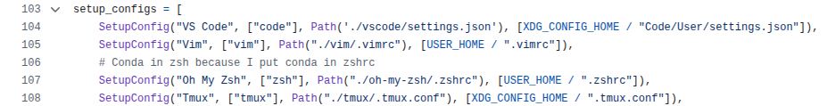

Recently, motivated by my friend [Hans](https://www.linkedin.com/in/hans-delano/), I added a custom CSS snippet to support collapsing/expanding the tab list by hover.

<div className="flex justify-center w-full">
  <div style={{ width: "min(450px, 100%)" }}>
		
  </div>
</div>


I mean, this is really quite convenient, and for the first time in a long time,
I felt that I should *replicate* this setup across my other devices.
so I unearthed my [dotfiles](https://github.com/Yongbeom-Kim/dotfiles) repo, which hadn't seen the light of day since 2024.

## Why I hated my (old) dotfile manager

A reason why the repo was in a state of disuse was that I didn't really like its design ever since I built it in 2023.

It was for two main reasons: I didn't really like how the dotfiles were tracked, and I'd grown to dislike the idea of symlinking dotfiles to version-controlled repos.

### Tracking Dotfiles

Fundamentally, a dotfile manager must keep two pieces of information in sync for every configuration file: the **contents**, and **location** of the dotfile.

You would typically do this with a central script of some sort, storing a mapping:

> `$GIT_ROOT/dotfiles/vim/.vimrc ⭢ $HOME/.vimrc`

{/* A power user might also introduce some abstractions, something like:

> "Everything in `./dotfiles/bin` is available in `$PATH`" */}

I also had done this with a python script back then:



Coming back to the repository after an entire year, I didn't think this was a good design.

I don't want to _remember_ that after introducing a new dotfile, I need to edit some other script to make things work, not to mention all the other abstractions I must have put in back then.

I think the dotfile contents and locations should be colocated together. I shouldn't need to edit two different places to do one thing.

### Symlinks

In 2023, I was sold on the idea that symlinks were the holy grail of dotfile management.
Create a symlink $HOME/.vimrc ⭢ .dotfiles/vim/.vimrc, and all updates stay in sync witversion control.

I can't say I feel the same now.

Dotfiles define how I interact with machines (if at all) — I am *literally* crippled when I `ssh` into a machine without my vim bindings.

Losing them, or any misconfiguration, opens up a small can of tiny inconveniences I must carefully reinvent the wheel for.

This time, I found the typical git-symlink workflow a little *too* invisible for my liking.
What if a `git pull` breaks your MacOS environment with a Linux-specific config?

I decided I'd rather every action be *explicit* and I.

## About `#!` Shebangs

Quick background before I go over my new design (feel free to skip this section if you know how shebangs work.)

Here is what that `#!/bin/bash` at the top of your script does. 

If you have a file `test.sh`:

```bash
#!/bin/bash

echo test
```

And you run `./test.sh` in your terminal, it is (almost) equivalent to running this in your terminal:

```bash
./test.sh
# this is like doing
/bin/bash ./test.sh
```

When you execute it, the kernel processes the file with the `execve` syscall.
Something like:

```python
execve("./test.sh", argv, envp)
```

Then, `execve` checks if the file starts with `#!`.
If it does, the kernel reads the first line (up to some limit),
parses the interpreter path + any arguments.

It then calls `execve` again, this time with the interpreter path as the program to execute,
and the script file as its first argument:

```python
execve("/bin/bash", ["/bin/bash", "./test.sh"], envp)
```

Naturally, there is no reason why it should be limited to `#!/bin/bash`.

For example, this prints the file back at you:

```bash
#!/bin/cat
echo this
```

Here is an infinite countdown:

```bash
#!/usr/bin/env -S bash -c 'n=$(tail -n1 "$0"); echo $n | tee -a "$0"; exec "$0";'
10
```

(Also, check out my [fork bomb](https://gist.github.com/Yongbeom-Kim/5cca2361e09beed2b252a275214d8f13), written entirely in the shebang.)

{/* 
Or try this fun one with GNU parallel (Linux-only, don't run it on anything too important)

```bash
#!/usr/bin/env -S bash -c 'tac "$0" | head -n -1 | parallel -n1 bash -c "n={}; echo $((n+1)) >> \"$0\"; exec \"$0\"" _ "$0"'
0
```
- this has some contention for the file, so it is still a fork bomb but it scales much slower. Why? Maybe a future post

```bash
#!/usr/bin/env -S bash -c 'tac "$0" | head -n -1 | xargs -P4 -I{} bash -c '\''n="$1"; echo $((n+1)) >> "$2"; exec "$2"'\'' _ {} "$0"'
0
``` */}


## New Dotfile Manager


You can probably see where I am going with this.

### Initial Design & Challenges

Initially, I thought aboud doing something like this:

```vim
./dotfile/vim/.vimrc
#!/usr/bin/env _copy_dotfile ${HOME}/.vimrc

" Remap esc key
inoremap kj <C-[>
inoremap jk <C-[>

" More things below
```

This gives us the following:

```bash
# if we execute the file
./dotfile/vim/.vimrc

# This is equivalent to
_copy_dotfile ${HOME}/.vimrc ./dotfile/vim/.vimrc
```

If our `_copy_dotfile` looked something like this:

```bash
#!/bin/bash
dst_path="$1"
src_path="$2"

cp "$src_path" "$dst_path"
```

Then running the dotfile would effectively copy it into its intended destination.

Simple setup, works well... until I wanted to track my editor settings.

### MacOS's Shebang Parser

Look at this file:

```json
./dotfiles/vscode-forks/cursor-settings.json
#!/usr/bin/env _copy_dotfile ${HOME}/Library/Application\ Support/Cursor/User/settings.json

{
	// ...
}
```

On Linux it works fine, but on MacOS you get something like:

```zsh
➜  dotfiles git:(main) ./dotfiles/vscode-forks/cursor-settings.json
/usr/local/bin/_copy_dotfile: eval: line 220: unexpected EOF while looking for matching `"'
```

Turns out, MacOS's shebang parser **doesn't allow you to escape spaces** (seriously?).
Looks like the parser uses a simple whitespace-based tokenizer that
doesn't respect shell quoting rules. You can wrap double quotes, single quotes,
or escape the space with a backslash, but it is always resolved as separate arguments.

MacOS's simplistic shebang parsing broke the portability I needed.

### Path Requirements

At this point, I also realized that my dotfile locations were going to be different in different operating systems. Look at my Cursor (VSCode) `settings.json` file path:

```bash
# In MacOS:
~/Library/Application Support/Cursor/User/settings.json
# In Linux:
~/.config/Cursor/User/settings.json # or,
${XDG_CONFIG_BASE}/Cursor/User/settings.json
```

It is really a shame, but this neat little one-line shebang trick cannot support this use case.

## The Second Rewrite (Hopefully the Last)

I still believed in the executable-dotfile philosophy, so I decided to bite the bullet
and write a simple parser in bash for a more expressive syntax.

### Parsing Dynamic Path

I decided on something like this:

```vim
./dotfiles/vim/.vimrc

#!/usr/bin/env _copy_dotfile
# target: ${HOME}/.vimrc

" Remap esc key
lnoremap kj <C-[>
inoremap jk <C-[>
```

For dotfiles with OS-specific paths, I came up with something like this:

```json
./dotfiles/vscode-forks/cursor-settings.json

#!/usr/bin/env _copy_dotfile
# target[Linux]: ${HOME}/.config/Cursor/User/settings.json
# target[Darwin]: ${HOME}/Library/Application\ Support/Cursor/User/settings.json

{
	// ...
}
```

The target argument goes something like `target[$(uname -s)]`, allowing me to define separate paths for MacOS,
parsed by a bash script. It throws an error when more than one target is resolved in the parser.

When copying the dotfile over, the parser will trim out the shebang and the `# target:` clauses.

The parser looks like this:

```bash
_get_target() {
	content=$1
	frontmatter="$(_get_frontmatter "$content")"

	os_name="$(uname -s)"
	targets=()
	while IFS= read -r line; do
		# Parse universal target
		if [[ "$line" == "# target:"* ]]; then
			target_raw="${line#*# target: }"
			# eval echo evaluates ${HOME} variable
			targets+=("$(eval echo "$target_raw")")
		fi

		# Parse os-specific target
		if [[ "$line" == "# target[$os_name]:"* ]]; then
			target_raw="${line#*# target*: }"
			# eval echo evaluates ${HOME} variable
			targets+=("$(eval echo "$target_raw")")
		fi

	done <<< "$frontmatter"

	if [[ "${#targets[@]}" -eq 0 ]]; then
		echo_stderr -e "${RED}No target found in file.${RESET}"
		return 1
	fi

	if [[ "${#targets[@]}" -gt 1 ]]; then
		echo_stderr -e "${RED}Multiple targets found in file. Only one should be specified. Targets: ${targets[@]}.${RESET}"
		return 1
	fi

	echo "${targets[0]}"
}
```

Find the full script [here](https://github.com/Yongbeom-Kim/dotfiles/blob/001a82b3f5e72e5d4b9fca22f149e8f11585e6d0/src/_copy_dotfile.sh).

### The Workflow

For the tool, I decided to adopt a git-like workflow.

Instead of symlinks, I decided I'd push/pull the dotfiles into their respective locations explicitly - think of having the *dotfiles* git repo, and those in their actual paths as a remote origin.

I define the following `make` commands:
```bash
make push           # Push dotfiles into their target locations; make backups.
make pull           # Pull and merge dotfiles from target locations into this repo
make backup         # Backup existing target dotfiles
make merge_backups  # Merge and remove backups into source dotfiles
make restore_backup # Restore backups of all dotfiles
make remove_backups # Remove backups of dotfiles in this repo
```

I can define the following commands in my executable:
```bash
./DOTFILE pull           # Merge this dotfile's target into itself.
./DOTFILE push           # Push this dotfile into its target location, make a backup.        
./DOTFILE backup         # Create a backup for this dotfile.
./DOTFILE restore_backup # Restore this dotfile's target from its backup.
./DOTFILE merge_backup   # Merge this dotfile's backup into itself.      
```

Merges are done with `git merge-file`, for nice and familiar merge conflicts. Each command, too, checks and throws if there are any git merge conflicts.

This allows me to define a very simple workflow, of doing `make pull`, resolve conflicts, and `make push` to synchronize dotfile changes, as if we were in a real git repo.

## Conclusion

Many hours went into writing, testing, and debugging bash scripts — but this version is one I'm finally happy with (at least until the next rewrite).

Each dotfile is now self-contained, declarative, and executable, with no hidden abstractions.

It feels *just* right for my dotfiles — prioritizing intention over convenience, explicit over automation, and transparency over abstraction.