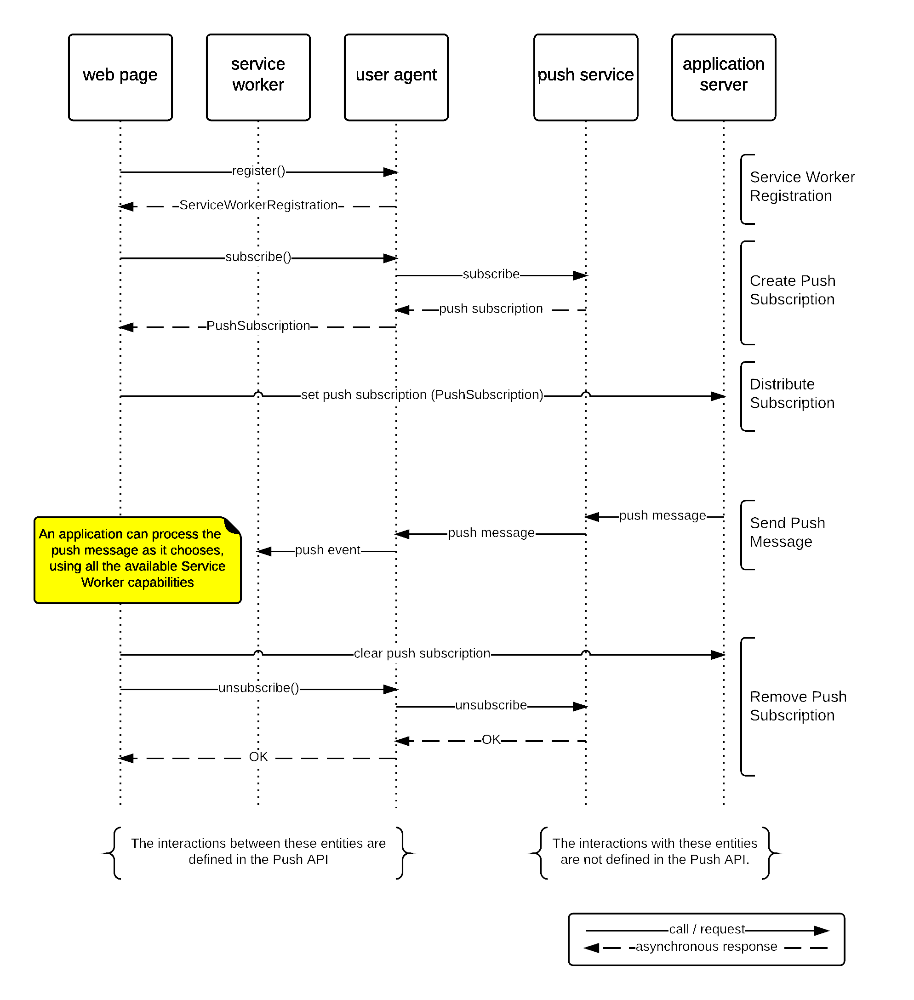

Web Push is a beautiful part of the internet.
*Without* a native app, it allows developers to send push notifications to their users.

Well, if you're the user getting spammed by a thousand different notifications, you might think differently.

But it is a system, despite its simplicity, is one where a thousand moving parts all work together to make it work.

Just look at all these moving parts:

  

    
  

Source: https://www.w3.org/TR/2025/WD-push-api-20250925/#sequence-diagram

But this post isn't really about how good Web Push is, it's about how confusing it has been.

## The Standards

Web Push works through the combination of the Push API Standard and the Notification API Standard.

The Push API Standard tells you how to send a push message to a server (presumably run by Google, Apple, or someone else),
and how the server will forward the message to your user's device.

The Notification API Standard tells you how to display a notification to the user.

## `PushSubscriptionOptions.userVisibleOnly`

## Resources for myself

- https://chatgpt.com/g/g-p-6811162731ac8191850ef5a9de697cbd-cold/c/68f77a71-f238-8321-9512-da48aa57d719
- https://chatgpt.com/c/68f77a05-f928-8324-b625-f7b50c9470ef
- https://chatgpt.com/c/68f73f1a-cea0-8323-a64c-dfb7a5b8ba53
- Firebase issue thread on iOS PWA drops subscriptions unexpectedly: https://github.com/firebase/firebase-js-sdk/issues/8010
- Firebase PWA service worker implementation: https://github.com/firebase/firebase-js-sdk/blob/main/packages/messaging-compat/src/messaging-compat.ts#L51S