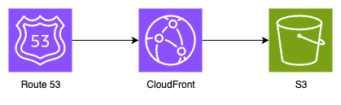
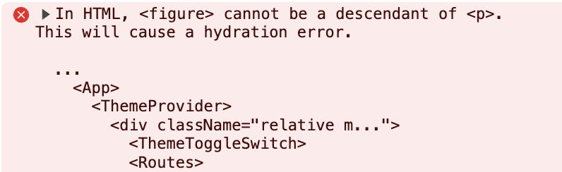

I told myself to start a blog many many times, but it was really only after a friend Karisse started her [own](https://karissekhoo.dev) that I truly found the motivation to build my own little corner of the internet.ments, and learnings from my journey in web development. I intend this to be both a place to share cool things, and a cool project in and as of itself.

## About this Blog

When it comes to software, I'm more of a do-it-myself kinda guy. I'm here to write code, not to play dependency lego, you know? For this reason, I'm starting *this* project with a minimalistic tech stack.

### The Current Stack

This blog is a simple React/Vite + Typescript project, with Tailwind for styling and MDX for writing posts. It is *not* SEO-optimized, currently renders content client-side (CSR), and is probably the most bare-bones and unoptimized blog you might find on the internet.

I am self-hosting it on AWS, with a pretty basic stack as well. The domain is on Route53, and the blog is hosted on an S3 bucket with a Cloudfront CDN in front of it.



I also have some funny little hacks as workarounds to solutions so far.

#### MDX Frontmatter

To be honest, I blame MDX's poor documentation for this. MDX's [documentation](https://mdxjs.com/docs/getting-started/) tells you to use the `mdx` plugin from `@mdx-js/rollup`, but it could not extract the markdown frontmatter I needed. After some frustration with the documentation (the [frontmatter guide](https://mdxjs.com/guides/frontmatter) was particularly useless), I decided to write the plugin myself.

```typescript
// vite.config.ts
const mdxPlugin: PluginOption = {
  name: "mdx-plugin",
  enforce: "pre",
  transform(src, id) {
    if (!id.endsWith(".mdx")) {
      return {
        code: src,
        map: null,
      };
    }
    const compiledCode = compileSync(src, {
      remarkPlugins: [remarkFrontmatter],
    });
    const vfile = new VFile({ path: id, value: src });
    matter(vfile);
    const frontMatter = vfile.data.matter as Record<string, any>;

    let code: string =
      compiledCode.value instanceof Uint8Array
        ? compiledCode.value.toString()
        : compiledCode.value;
    code = code.replace(
      "export default function MDXContent",
      "export function Content"
    );
    code += "\n" + "export const frontmatter = " + JSON.stringify(frontMatter);
    return {
      code,
      map: null,
    };
  },
};
```

Of course, right after I write this, I discover the plugin [`remark-mdx-frontmatter`](https://github.com/remcohaszing/remark-mdx-frontmatter). Too late.

#### Paragraph Override

Another thing I discovered was that MDX loves putting everything in paragraph tags. To support image captions, I decided to override my images with `<figure>` tags, and that gives you this problem:



Of course, the fix is to switch out all `<p>` tags with `<div>` tags.

```typescript
// src/pages/post/mdx-components/P.tsx
export function P(props: { children: ReactNode }) {
  return <div className="mb-3">{props.children}</div>
}
```

## Wrapping Up

So there we go, my first step into blogging! I'm excited to share my journey, learnings, and insights with you all.